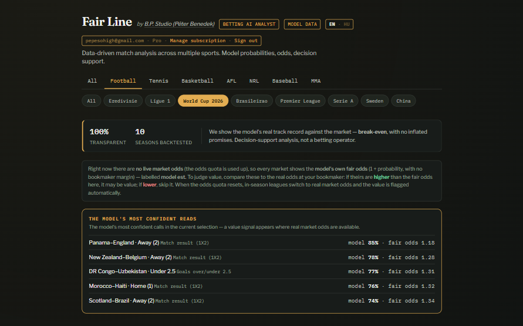
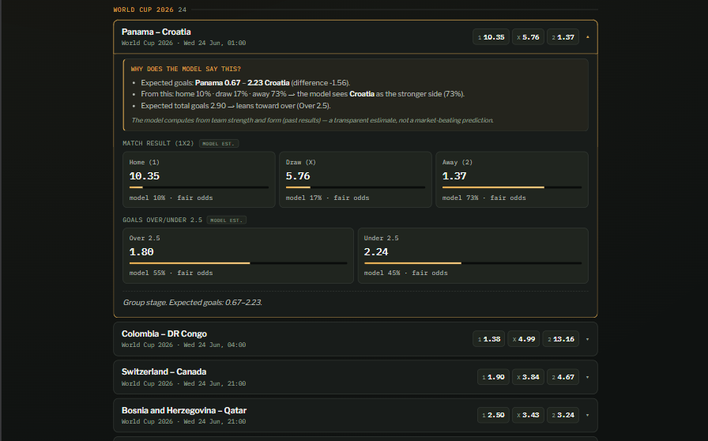
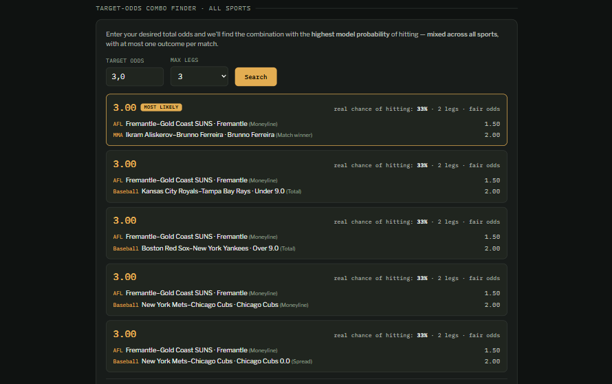

# Fair Line — Betting AI Analyst

[](https://github.com/benedekpepe/fair-line/actions/workflows/ci.yml)

A multi-sport, data-driven **match-analysis** tool. Fair Line fits statistical
models to historical results, turns them into **fair odds** (probabilities with
no bookmaker margin), and — where live market odds are available — flags where
the model and the market disagree.

It is built as an **honest decision-support tool, not a profit machine.** The
model's real, backtested track record against the market is **roughly
break-even**, and the app says so openly: no inflated promises, no affiliate or
bookmaker links, no "guaranteed picks". 18+.

> **Prototype / portfolio project.** Information only, not betting or financial
> advice, and no guarantee of any result. Payments run in **test mode** (no real
> charges). See the in-app disclaimer and the Terms / Privacy pages.

**Live demo:** <https://fair-line.netlify.app/> — the free tier is open to browse
with no sign-up. To see the Pro features, register and subscribe with the
LemonSqueezy **test card** `4242 4242 4242 4242` (any future expiry, any CVC) —
it runs in test mode, so there is **no real charge**.

## Why it exists

Most "betting AI" products promise edges they can't deliver. Fair Line takes the
opposite stance: build solid models, show the math transparently, and let the
user compare the model's fair odds against the market themselves. If the model
beats the market, great — if it doesn't (and over a full backtest it mostly
doesn't), the app shows that honestly. The value is **transparent analysis**,
not a promise of profit.

## Features

- **Eight sports, one consistent UI** — football, tennis, basketball (NBA /
  WNBA / EuroLeague), baseball (MLB), ice hockey (NHL), American football (NFL),
  Australian football (AFL), rugby league (NRL) and combat sports (UFC / boxing).
- **Fair odds + value flags** — every market shows the model's probability and
  the fair odds (`1 / probability`). When real market odds are available, the
  app computes value automatically (model vs market) with a ±30% sanity cap.
- **"Why does the model say this?"** — each match shows a plain-language
  breakdown: expected goals / points, the stronger side, and the over/under lean.
- **Credit-resilient data layer** — when the paid odds quota runs out, the app
  falls back to **free ESPN fixtures** and shows the model's read across
  moneyline, spread and total. The app never goes empty.
- **Backtested model accuracy** — per-sport accuracy / Brier / log-loss vs a
  naive baseline, so claims are grounded, not hand-waved.
- **Combo finder** — given a target total odds, finds the highest-probability
  combination across all sports (one leg per match), and explains the real
  chance of hitting vs the fair odds.
- **Bilingual** — full Hungarian / English UI.
- **Full stack** — static frontend, Supabase auth + database, LemonSqueezy
  subscriptions.

## Screenshots

**Overview — the match board and the model's most confident reads**

The home view: upcoming matches across the selected sport / league, plus the
model's most confident calls in the current selection.



**Match detail — the model's reasoning and every market**

Each match opens to a plain-language "why", the 1X2 / moneyline read and the
goals/total market, with the model's probability and fair odds per outcome.



**Target-odds combo finder — mixed across all sports**

Enter a target total odds and the finder returns the highest-probability
combination (one leg per match), with the real chance of hitting spelled out.



## How the models work

| Sport group | Model | Outputs |
|---|---|---|
| Football | **Dixon–Coles** bivariate Poisson, time-weighted, with a low-score correlation term | 1X2, Over/Under 2.5, Asian handicap |
| Tennis | **Surface-aware Elo** (general + clay) from match history | Match winner |
| NBA / WNBA / MLB / NHL / NFL / AFL / NRL / EuroLeague | **Margin model**: per-team offensive / defensive ratings + home advantage; normal approximation for margin and total | Moneyline, spread, total |
| UFC / boxing | **Fighter Elo** with shrinkage toward 50% for low-sample fighters (avoids fake edges) | Match winner |

Two cross-cutting touches:

- **Fair odds, no margin** — the displayed odds are `1 / model probability`, i.e.
  the "true" odds the model implies. A bookmaker always pays less; the gap is
  their margin. Higher real odds than the fair odds means potential value.
- **Postseason total dampening** — in playoffs / finals, defense tightens and
  pace slows, so totals run lower. When ESPN flags a game as postseason, the
  expected **total** is scaled down ~4% (margin and win probability untouched).

## Data sources

- **The Odds API** — live bookmaker odds (1X2, totals, spreads, h2h).
- **football-data.org** — World Cup fixtures (free tier).
- **football-data.co.uk** — historical club results for the league models.
- **Jeff Sackmann's tennis_atp / tennis_wta** datasets — tennis match history
  (CC BY-NC-SA, non-commercial). Fetched on demand into a local cache and not
  bundled with the repo; the tennis Elo is optional and is skipped when the
  history is unavailable.
- **ESPN public scoreboard API** — free upcoming fixtures, historical results,
  and the postseason flag. Used as the resilient fallback when paid odds are
  unavailable.

All historical pulls are cached locally (and excluded from the repo / package).

## Tech stack

- **Models & pipeline:** Python (NumPy, pandas, SciPy). No heavyweight ML
  frameworks — the models are transparent and fast to refit.
- **Frontend:** single-file vanilla HTML / CSS / JS (no build step), with a tiny
  i18n layer (HU / EN).
- **Backend:** Supabase (Postgres + Auth + Row-Level Security).
- **Payments:** LemonSqueezy (Merchant of Record), Free + Pro tiers.

## Architecture & data flow

1. **Build** (`src/run_all.py`) — the exporters fit the models on cached history,
   pull live odds (or fall back to free ESPN fixtures), and write every match
   card to `web/data.js`.
2. **Publish** (`sync_supabase.py`) — the same cards are pushed to Supabase: the
   free part to the `matches` table, the paid extras + model internals to
   `match_details`.
3. **Serve** — the static frontend (`web/index.html`) reads its data, localises
   it (HU / EN) and renders. Match data is served from a dedicated `data` branch
   over the jsDelivr CDN, so daily refreshes never trigger a redeploy.

## Accounts, subscriptions & demo mode

- **Auth** — Supabase email/password. On sign-up a `profiles` row is created
  automatically by a Postgres trigger, capturing the name, the 18+ confirmation
  and the Terms acceptance.
- **Free vs Pro** — anyone (even logged-out) sees the base card and headline
  odds (`matches`, public read). The extra markets, the "why does the model say
  this" layer and the combo finder come from `match_details`, which
  **Row-Level Security only lets active subscribers read** — `is_subscriber()`
  checks the user's profile inside the database, so the gate is enforced
  **server-side**, not merely hidden in the UI.
- **Payments** — LemonSqueezy (Merchant of Record). A webhook
  (`supabase/functions/lemonsqueezy-webhook`) updates `subscription_status` when
  a subscription starts, renews or is cancelled. **Currently test mode — no real
  charges.**
- **This deployment (live mode)** — the public site runs the **full auth +
  subscription flow** so the whole stack is visible end to end. Browse the free
  tier with no account; to unlock Pro, register and subscribe. Because
  LemonSqueezy is in **test mode**, the checkout accepts the **test card**
  `4242 4242 4242 4242` (any future expiry, any 3-digit CVC) — so the entire
  paywall can be exercised with **no real charge**, and the server-side unlock
  (RLS) can be seen working.
- **Demo mode (optional)** — alternatively, leaving the Supabase keys in
  `web/index.html` as placeholders runs the app in a keyless **demo** mode: no
  sign-up, every Pro feature unlocked, a "DEMO" badge shown — a zero-friction
  preview that skips auth entirely.

## Project structure

```
fair-line/
├─ src/
│  ├─ run_all.py            # orchestrator: runs the exporters, then pushes to Supabase
│  ├─ config.py             # project paths + .env loader (single source of truth)
│  ├─ sync_supabase.py      # push the built cards to Supabase (REST)
│  ├─ models/               # statistical models
│  │  ├─ dixon_coles.py     # football: bivariate Poisson (Dixon–Coles)
│  │  ├─ margin_model.py    # team-score sports: offence/defence + home edge
│  │  ├─ tennis_elo.py      # tennis: surface-aware Elo
│  │  └─ fighter_elo.py     # combat sports: fighter Elo with shrinkage
│  ├─ sources/              # data sources
│  │  ├─ espn_loader.py     # free ESPN data (fixtures / history / postseason)
│  │  └─ odds.py            # live market odds (The Odds API) -> value signal
│  ├─ exporters/            # per-sport card builders (model + odds + ESPN fallback)
│  │  ├─ export_all.py          export_club_auto.py     export_odds_leagues.py
│  │  └─ export_tennis_odds.py  export_margin_odds.py   export_fights_odds.py
│  └─ backtests/
│     ├─ backtest.py        # football ROI backtest (honest test vs the market)
│     └─ backtest_models.py # per-sport accuracy / Brier / log-loss
├─ web/
│  ├─ index.html            # the entire app (HTML/CSS/JS, i18n)
│  ├─ terms.html  privacy.html
│  └─ favicon.svg
├─ supabase/
│  ├─ schema.sql  seed.sql
│  └─ functions/lemonsqueezy-webhook/index.ts
├─ docs/                    # screenshots used in this README
├─ .github/workflows/       # CI + scheduled data refresh
├─ data/raw/                # cached historical CSVs (regenerated; not shipped)
├─ .env.example             # required environment variables (no secrets)
├─ netlify.toml             # static-site publish config
├─ package_project.py       # clean-zip helper for sharing
├─ requirements.txt
└─ README.md
```

## Getting started

1. **Install dependencies**
   ```bash
   pip install numpy pandas scipy
   ```
2. **Configure** — copy `.env.example` to `.env` and fill in your keys
   (The Odds API, football-data.org, Supabase URL + service key).
3. **Build the data**
   ```bash
   cd src
   python run_all.py            # full pipeline -> builds data + pushes to Supabase
   python run_all.py --no-odds  # build without spending API credits (model only)
   ```
4. **Serve the frontend** (from the project root)
   ```bash
   python -m http.server 8000
   ```
   Open <http://localhost:8000/web/>.
5. **(Optional) Backtest the models** (from `src/`)
   ```bash
   python -m backtests.backtest_models   # per-sport accuracy / Brier / log-loss
   ```

## Deployment

The frontend is a static bundle — the `web/` folder — hosted on **Netlify**
(production branch: `main`). The public site runs the full auth + subscription
flow (Supabase + LemonSqueezy in **test mode**): the free tier is open to all,
and Pro can be unlocked with the test card above.

Continuous integration / delivery runs on **GitHub Actions**:

- **CI** (`.github/workflows/ci.yml`) — on every push: syntax check, lint
  (pyflakes), and an import smoke test.
- **Daily data refresh** (`.github/workflows/refresh.yml`) — runs the pipeline in
  the cloud and publishes the regenerated `data.js` to a dedicated **`data`
  branch**. The frontend loads that file over the **jsDelivr** CDN, so data
  updates never touch `main` and never trigger a Netlify deploy — the demo stays
  fresh at zero hosting cost. The board shows **upcoming** matches only and drops
  each one the moment it starts; even with the odds quota used up, the free
  **ESPN fallback** keeps it populated.

## Responsible use

Fair Line is for **information and analysis only**. It is **not** betting advice
or financial advice, does **not** guarantee any result, and is **not** a betting
operator. Gambling can be addictive — 18+ only. If gambling affects your life,
please seek help.

## License

Proprietary — © 2026 Péter Benedek (B.P. Studio). Published for **portfolio and
evaluation only**; not licensed for reuse, redistribution, or deployment without
written permission. See [LICENSE](LICENSE). Third-party data and APIs remain
subject to their providers' own terms.

## Author

Built by **Péter Benedek** — B.P. Studio
[Portfolio](https://benedekpeter.netlify.app/) · [GitHub](https://github.com/benedekpepe) · [LinkedIn](https://www.linkedin.com/in/benedek-d-peter/)
